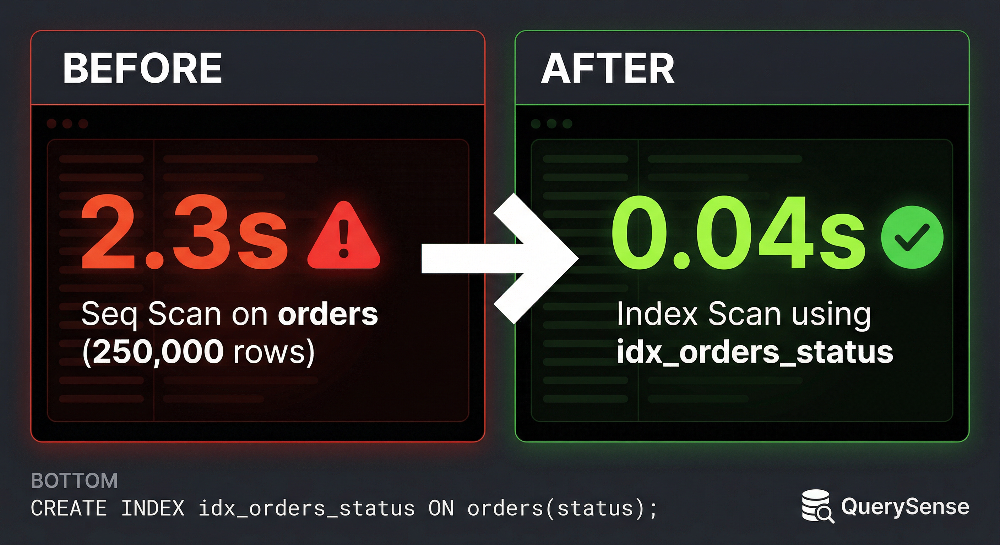

# QuerySense

<p align="center">
  
</p>

<p align="center">
  <a href="https://pypi.org/project/querysense/"></a>
  <a href="https://www.python.org/downloads/"></a>
  <a href="https://opensource.org/licenses/MIT"></a>
  <a href="https://github.com/JosephAhn23/Query-Sense/actions/workflows/ci.yml"></a>
</p>

Free, open-source database optimizer. Paste an EXPLAIN plan, get copy-paste SQL fixes. PostgreSQL, MySQL, MongoDB, SQL Server. Works offline. No account required.

## Install

```bash
pip install querysense
```

## Usage

```bash
# Analyze a slow query
querysense analyze plan.json

# Get copy-paste SQL fixes
querysense fix plan.json > fixes.sql

# Scan a live database
querysense scan --dsn postgresql://localhost/mydb

# Compare before/after
querysense diff before.json after.json

# CI/CD gate
querysense ci gate
```

## Example Output

```
$ querysense analyze bad_estimate.json

[CRITICAL] Stale statistics on orders (5000x underestimated)
  Fix: ANALYZE orders;

[CRITICAL] Time bottleneck: Hash Join consumes 96% of execution time
  Fix: Check row estimates and statistics freshness

[WARNING] Seq Scan on orders (cost=2,134, 250,000 rows)
  Fix: CREATE INDEX idx_orders_total_amount ON orders (total_amount);

[WARNING] High cache miss rate on orders: 38% of blocks read from disk
  Fix: Increase shared_buffers or pre-warm cache

[WARNING] Full table scan on users (50,000 rows, no filter)
  Fix: Add a WHERE clause or LIMIT to filter rows

12 findings in 2.1ms
```

## Tests

190 tests, all passing in under 1 second.

```
$ pytest tests/ -v

tests/test_parser.py      29 passed
tests/test_integration.py  37 passed
tests/test_dag.py          20 passed
tests/test_ir.py           15 passed
...
======================== 190 passed in 0.89s ========================
```

## License

MIT
