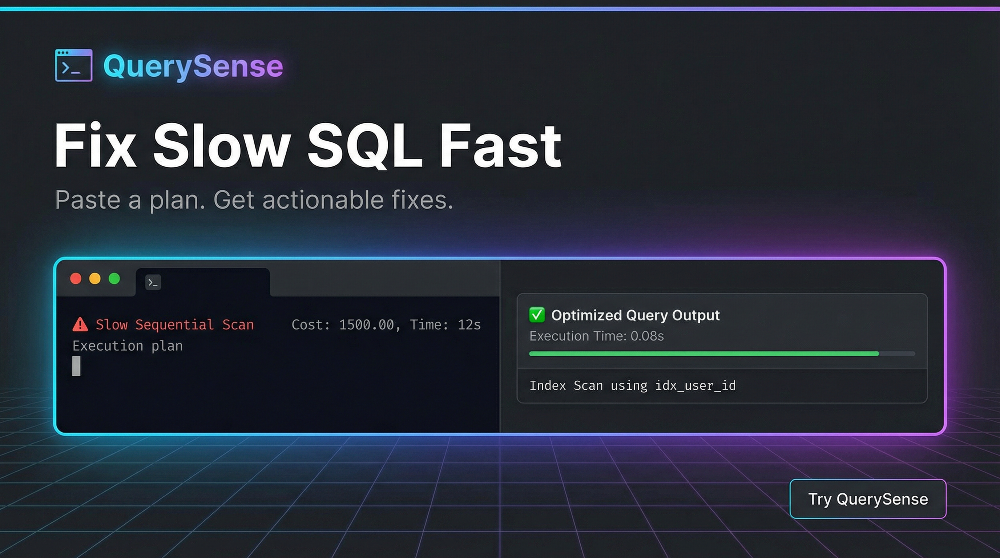
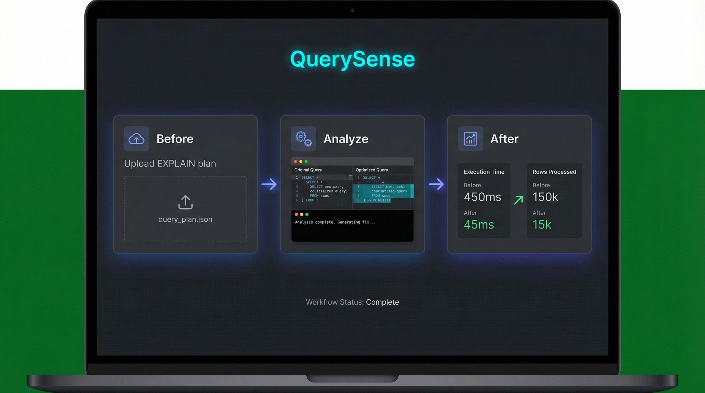
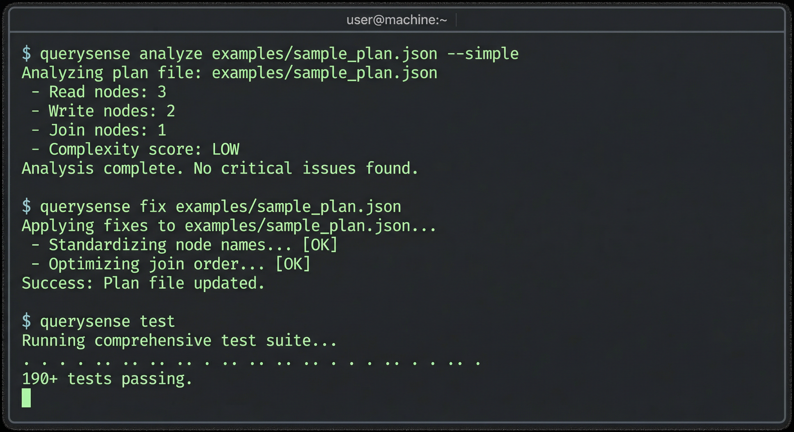

# QuerySense

<p align="center">
  <strong>Turn slow SQL into fast SQL in minutes.</strong><br/>
  Paste an execution plan, get clear fixes you can copy-paste.
</p>

<p align="center">
  <a href="https://pypi.org/project/querysense/"></a>
  <a href="https://www.python.org/downloads/"></a>
  <a href="https://github.com/JosephAhn23/Query-Sense/actions/workflows/ci.yml"></a>
  <a href="https://opensource.org/licenses/MIT"></a>
</p>

<p align="center">
  
</p>

<p align="center">
  <sub>
    Dark-mode friendly README: neon accents, visual flow, low jargon.
  </sub>
</p>

---

## Why people like it

- **Fast wins:** see bottlenecks and likely fixes right away
- **Human-friendly:** plain-English output (`--simple`, `--eli5`) for non-DBA users
- **Actionable:** generate SQL fixes and migration files from findings
- **Multi-engine:** PostgreSQL, MySQL, SQL Server, MongoDB support in one CLI
- **Private-first:** works offline, no account required

---

## Glow Workflow

> **Before:** "Why is this query slow?"  
> **After:** "Here is the exact fix and expected impact."

### 1) Analyze a plan

```bash
querysense analyze plan.json
```

### 2) Generate fixes

```bash
querysense fix plan.json > fixes.sql
```

### 3) Compare before vs after

```bash
querysense diff before.json after.json
```

---

## Quick Start (Copy/Paste)

```bash
pip install querysense
querysense analyze plan.json --simple
querysense fix plan.json > fixes.sql
```

---

## Visual Walkthrough

Dark-mode visuals for a quick product tour:

```text
docs/media/readme/
  readme-hero-dark.png
  readme-workflow-dark.png
  readme-cli-dark.png
```

### Workflow view

**Before -> Analyze -> After:** upload a plan, get actionable fixes, validate improvements.

### CLI proof

Realistic terminal-style proof block for analysis and fix commands.

---

## Example Output

```text
$ querysense analyze plan.json

[WARNING] Seq Scan on orders (250,000 rows)  ~4.8x faster with index
  Fix:
  CREATE INDEX idx_orders_status ON orders(status);

[WARNING] Row estimate 5,000x off on orders
  Fix:
  ANALYZE orders;

Analyzed 2 findings in 1.5ms
```

---

## Feature Highlights

- **Plan Analysis:** detect costly scans, bad estimates, spills, and join issues
- **Safe SQL Rewrites:** `querysense rewrite --sql ...` with optional sandbox checks
- **Migration Outputs:** Flyway, Liquibase, Alembic, Django, dbmate formats
- **I/O Visibility:** buffer-focused analysis and before/after comparisons
- **CI Integration:** fail builds on performance regressions with `querysense ci`

---

## Credibility Snapshot

- **Version:** `2.0.0`
- **Tests:** 190+ tests
- **Rules:** 37+ detection rules
- **Python:** 3.11+

---

## Pro Tips for a Dark-Mode “Glow” README

- Use badges with deep backgrounds (`1f2937`, `0f172a`) plus neon accents
- Keep paragraphs short; rely on visuals, whitespace, and bold labels
- Prefer "before/after" captions over technical internals
- Add one short GIF at top and 3 step GIFs below for instant trust

---

## Install

```bash
pip install querysense
```

## License

MIT
